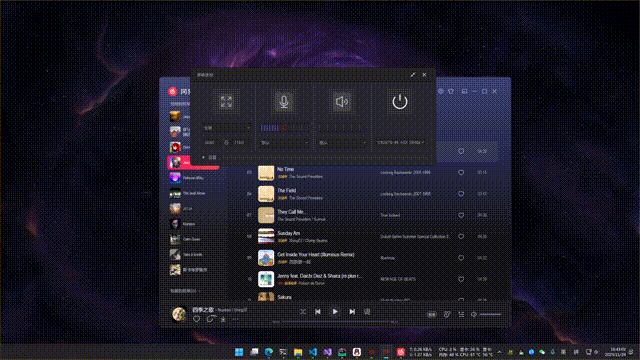

# ScreenRecorder 

基于[OBS](https://github.com/obsproject/obs-studio)开发的一款桌面录制软件，可以实现在**全屏**及**指定区域**录制。

开发套件：Qt 5.15.2, C++17 

目前仅window平台通过编译，mac\linux平台暂未验证（主要是没测试用机器）
---

## Release
[下载链接](https://github.com/Type3limit/ScreenRecorder/releases)

---
## 效果预览



---
## 操作快捷键

基于[QHotKey](https://github.com/Skycoder42/QHotkey)项目，集成于此[文件夹](./helper)

>预留```Alt+S```作为debug快捷键，可以唤起预览窗口检查当前采集画面，预览如下：


## 构建相关

[bin](./bin)目录中保存了预编译好的OBS-plugin链接库，基于[当前cmake](./CMakeLists.txt)的默认构建会生成于对应构建目录中。
